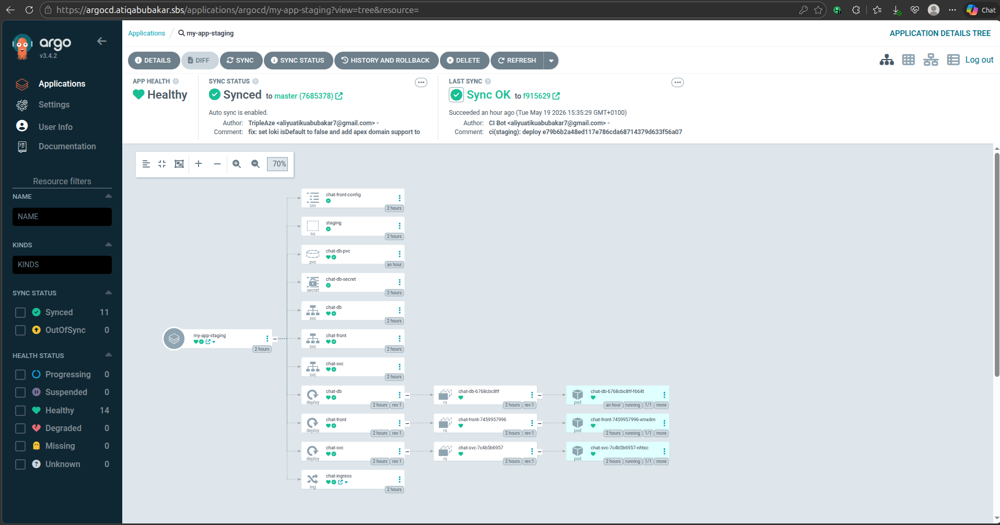
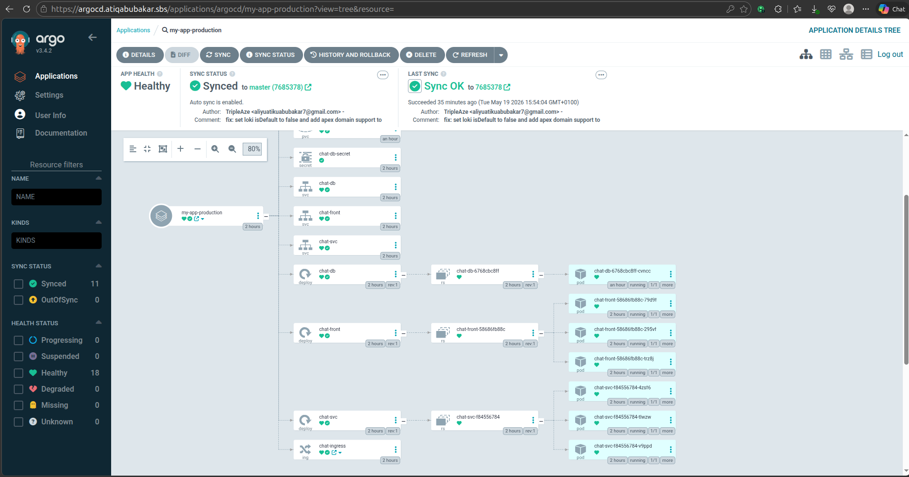

# Production-Grade Platform Verification Portfolio

This verification portfolio serves as the definitive visual audit for the **TripleAze Production-Grade Cloud-Native DevOps Platform**. The real-world screenshots documented below validate the successful automation of our Continuous Integration (CI) pipelines, Continuous Delivery (GitOps) state syncs, high-availability cluster runtimes, and deep system observability (metrics, resource usage, and log aggregation).

---

## 1. Continuous Integration & Deployment (GitHub Actions)

Our CI/CD pipelines are fully automated using GitHub Actions. The pipeline handles linting, building, scanning, and pushing Docker container images to Amazon ECR, and prompts for manual approval before shipping changes to production.

### Automated CI Pipeline Success
* **File Path:** `docs/screenshots/CI Successfull run.png`
* **Validation:** Confirms that the full build, scan, and test workflow finishes flawlessly, generating new container images for the microservices.
* **Visual:**
  

### Production Push Approval Gate
* **File Path:** `docs/screenshots/CI requesting Approval to Push to Production.png`
* **Validation:** Shows the automated pipeline pausing at the manual approval gate, securing the production branch from unauthorized or untested changes.
* **Visual:**
  

### Executed Production Deployment Authorization
* **File Path:** `docs/screenshots/CI Manual Approval.png`
* **Validation:** Illustrates the authorized administrator granting approval, triggering the immediate deployment stage to EKS.
* **Visual:**
  

---

## 2. Declarative GitOps Synchronization (ArgoCD)

I employed **ArgoCD** to achieve automated GitOps state reconciliation. ArgoCD monitors the manifests repository and guarantees that the live EKS cluster state matches the git-defined state.

### ArgoCD Unified Applications View
* **File Path:** `docs/screenshots/AgroCD Applications.png`
* **Validation:** Displays both environments—`my-app-staging` and `my-app-production`—in a fully synchronized (`Synced` & `Healthy`) state.
* **Visual:**
  

### Staging Application Infrastructure Tree
* **File Path:** `docs/screenshots/argocd-staging-app.png`
* **Validation:** Details the complete resource tree of the Staging environment (`staging` namespace), showing services, deployments, replicasets, pods, and ingress definitions.
* **Visual:**
  

### Staging Active Deployment Status
* **File Path:** `docs/screenshots/Staging Deployment.png`
* **Validation:** Shows the explicit active Sync OK status matching the latest staging commit ID.
* **Visual:**
  

### Production Application Infrastructure Tree
* **File Path:** `docs/screenshots/argocd-production-app.png`
* **Validation:** Details the highly available Production environment (`production` namespace) with scaled replica sets, isolated database PVs, and TLS ingress controllers.
* **Visual:**
  

### Production Active Deployment Status
* **File Path:** `docs/screenshots/Production Deployment.png`
* **Validation:** Confirms the synchronized production state, pointing directly to the main release tag commit.
* **Visual:**
  

---

## 3. High-Availability Cluster Runtime (K9s View)

A stable cluster runtime forms the foundation of my high-availability operations. EKS Auto Mode manages Karpenter node provisioning and EBS volume binding dynamically.

### Active Container Runtimes Showcase
* **File Path:** `docs/screenshots/All-Pods-running-view-on K9s.png`
* **Validation:** Visualizes the `k9s` console showing all pods under `argocd`, `kube-system`, `observability`, `staging`, and `production` namespaces in perfect `Running` state with zero crash loops or restarts.
* **Visual:**
  

---

## 4. Deep Observability — Metrics (Prometheus & Grafana)

The metrics pipeline collects live kernel and container metrics, exposing them through visually striking dashboards for monitoring CPU, memory, network traffic, and pod health.

### Grafana Central Console
* **File Path:** `docs/screenshots/Grafana Dashboard.png`
* **Validation:** Confirms the secure entry and initialization of our customized Grafana dashboard running at `https://grafana.atiqabubakar.sbs`.
* **Visual:**
  

### Prometheus Metric Explorer (Staging)
* **File Path:** `docs/screenshots/Prometheus showing metrics on Staging .png`
* **Validation:** Demonstrates active metric capture for the staging environment workloads.
* **Visual:**
  

### CPU Resource Utilization (Staging Pods)
* **File Path:** `docs/screenshots/CPU usage metics by Staging Pods.png`
* **Validation:** Real-time graphs showing CPU utilization patterns across staging workloads.
* **Visual:**
  

### Prometheus Metric Explorer (Production)
* **File Path:** `docs/screenshots/Prometheus Showing metrics fromProduction .png`
* **Validation:** Proves live metric gathering from the critical production namespace services.
* **Visual:**
  

### CPU Resource Utilization (Production Pods)
* **File Path:** `docs/screenshots/CPU usgage by Production Pods.png`
* **Validation:** Real-time graphs showing CPU utilization, demonstrating resource isolation and traffic balancing across production replica sets.
* **Visual:**
  

---

## 5. Deep Observability — Log Aggregation (Loki & Promtail)

The log aggregation pipeline uses Promtail daemonsets to harvest stdout/stderr streams from all Kubernetes pods and stream them directly into a centralized Loki instance.

### Centralized Loki Live Stream
* **File Path:** `docs/screenshots/Loki Collecting live logs.png`
* **Validation:** Visualizes Grafana's Explore tab streaming real-time Loki-aggregated log lines from across the cluster.
* **Visual:**
  

### Production Workload Isolated Log Streams
* **File Path:** `docs/screenshots/Loki showing logs from Production pods.png`
* **Validation:** Shows isolated logs filtered specifically for the production application pods, demonstrating searchability and system audit readiness.
* **Visual:**
  

---

## 6. Active Alerting & Incident Response (Alertmanager)

Alerting ensures that operations teams are proactively notified of cluster anomalies. Prometheus continuously evaluates metric rules and routes active alerts directly to Alertmanager for deduplication, grouping, and notification routing.

### Alertmanager Incident Control Center
* **File Path:** `docs/screenshots/Alertmanager Active Alerts.png`
* **Validation:** Showcases the active Alertmanager UI (accessed via port-forwarding on port `9093`), listing active alert groupings (such as the system-wide `Watchdog` heartbeat and standard unreachable EKS-managed control plane metrics), proving the alerting pipeline is fully functional and ready to route incident notifications.
* **Visual:**
  

