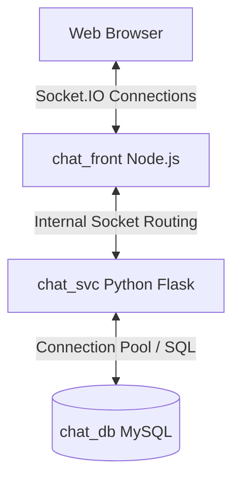

# Multi-Service Real-Time Chat Application

This repository contains the source code for the **TripleAze Real-Time Chat Suite**. It is designed to demonstrate low-latency asynchronous microservices communication inside a Kubernetes cluster using **WebSockets (Socket.IO)** and persistent MySQL storage.

---

## Application Architecture

The suite consists of three decoupled application tiers cooperating inside the cluster:



### 1. Frontend Web App (`chat_front`)
- **Technology Stack:** Node.js, Express, Socket.IO Client.
- **Role:** Exposes a sleek, interactive web interface for the chat lobby. Establishes long-polling or WebSocket upgrades back to the client and acts as an asynchronous interface routing traffic to the backend services.

### 2. Core Service Backend (`chat_svc`)
- **Technology Stack:** Python, Flask, Flask-SocketIO, PyMS library.
- **Role:** Handles incoming Socket.IO events, manages chat room states, broadcasts messages dynamically, and communicates with `chat_db` to fetch or store records.

### 3. Database Layer (`chat_db`)
- **Technology Stack:** MySQL Server.
- **Role:** Houses the persistent message ledger. Scaled dynamically via EKS gp3 volumes to guarantee high-performance ACID transactions.

---

## 1. Local Development (Docker Compose)

You can spin up the entire application stack locally in seconds using Docker Compose. This completely eliminates the need for manual configuration or local database setups.

### Boot the stack:
```bash
docker compose up --build
```

- **Frontend Lobby:** Acccess `http://localhost:3000`
- **Backend Service:** Access `http://localhost:5000`
- **MySQL Database:** Local port binding `127.0.0.1:3306`

---

## 2. Production Containerization (Dockerfiles)

Each tier has been optimized using multi-stage, lightweight Docker builds to minimize surface areas and speed up deployment cycles.

### Building Container Images manually:
```bash
# Build Frontend
docker build -t chat-front:latest -f chat_front/Dockerfile chat_front/

# Build Backend Service
docker build -t chat-svc:latest -f chat_svc/Dockerfile chat_svc/

# Build Database
docker build -t chat-db:latest -f chat_db/Dockerfile chat_db/
```

---

## 3. Cloud-Native Kubernetes Integration

For production, these services are compiled, versioned, and managed declaratively via GitOps:

1. **Continuous Integration**: The `.github/workflows/ci.yml` pipeline automatically builds each service and pushes versioned images to **Amazon ECR**.
2. **Declarative Manifests**: Environment overrides, services, service accounts, configurations, and TLS/ALB ingress configurations are defined in the `k8-manifests` repository.
3. **Continuous Delivery**: **ArgoCD** continuously pulls the declarative state and keeps the AWS EKS workloads automatically updated.
